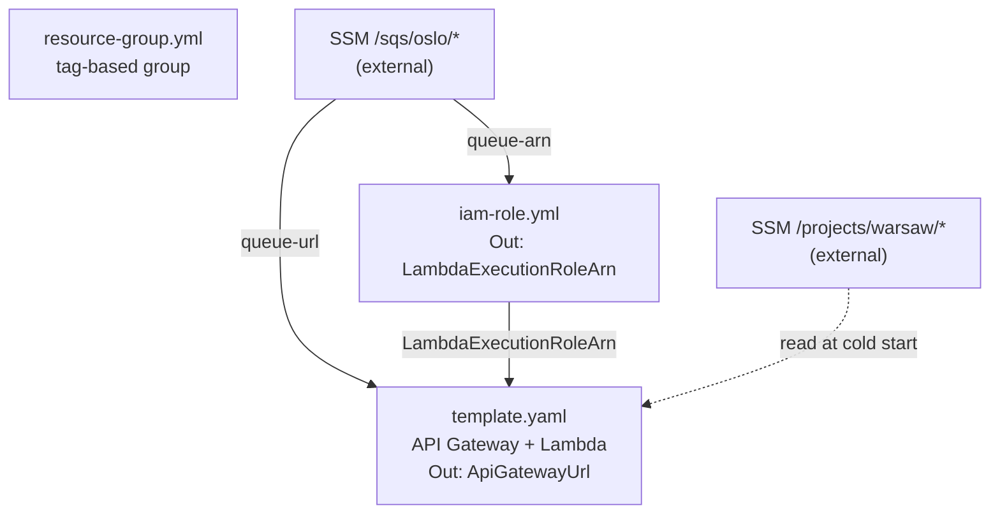

# warsaw-self-signed-rest-api

REST API with `private_key_jwt` client authentication (RFC 7523) and self-signed RS256 access
tokens, published through a JWKS endpoint. Authenticated request bodies are enqueued to the
shared oslo SQS queue.

## Endpoints

| Method | Path | Auth | Purpose |
| --- | --- | --- | --- |
| `POST` | `/oauth/token` | client assertion | issue an access token |
| `GET` | `/.well-known/jwks.json` | none (IP-gated) | publish the token verification key |
| `POST` | `/` | `Bearer` token | enqueue the request body |

All routes additionally sit behind an API Gateway resource policy that denies any source IP
outside the `/allowed-ips/all` SSM list.

## Getting a token

```bash
curl -X POST "$API/oauth/token" \
  -d grant_type=client_credentials \
  -d client_assertion_type=urn:ietf:params:oauth:client-assertion-type:jwt-bearer \
  -d client_assertion="$ASSERTION"
```

The assertion is a JWT signed with the client's private key (RS256) carrying `iss` and `sub`
set to the client id, `aud` set to `https://auth.molnarbence.dev/`, and an `exp` no more than
300 seconds out.

## Keys

| Key | Location | Purpose |
| --- | --- | --- |
| client private | held by the client only | signs the client assertion |
| client public | `app/keys/client_public.pem` | verifies the assertion |
| signing private | SSM `/projects/warsaw/jwt-private-key` | signs access tokens |
| signing public | derived at runtime | served at `/.well-known/jwks.json` |

Generate them with `make keypair-client` and `make keypair-signing`. Private keys land in the
gitignored `out/` directory and must never be committed.

## Development

```bash
make install-dev   # install dependencies
make test          # lint + unit tests
make cfn-lint      # lint CloudFormation templates
```

## CloudFormation stack diagram



---

## Deployment runbook

Not part of the plan's tasks — these are the manual steps needed once before the first deploy.

1. `make keypair-signing`, then:
   ```bash
   aws ssm put-parameter --name /projects/warsaw/jwt-private-key --type SecureString \
     --overwrite --value "file://out/warsaw_private.pem"
   rm out/warsaw_private.pem
   ```
2. ```bash
   aws ssm put-parameter --name /projects/warsaw/allowed-client-id --type String \
     --overwrite --value "<the agreed client id>"
   ```
3. Deliver `out/client_private.pem` (from Task 10) to the client over a secure channel, then
   delete the local copy.
4. Push to `main` to trigger the deploy.

## Post-deploy smoke test

```bash
API=$(aws cloudformation describe-stacks --stack-name warsaw-lambda \
  --query 'Stacks[0].Outputs[?OutputKey==`ApiGatewayUrl`].OutputValue' --output text)
curl -s "${API}.well-known/jwks.json" | jq .
```

Expected: a single JWK whose `kid` matches the one printed by `make keypair-signing`. A `kid`
mismatch means the SSM parameter and the key you distributed are different keys.
